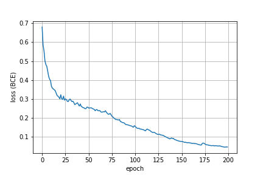
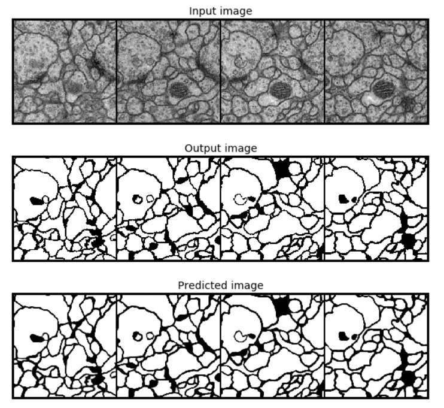

unet-pytorch |
============
A Pytorch implementation of UNet from [arXiv](https://arxiv.org/pdf/1505.04597.pdf)


### Install

Clone repo:
```
git clone https://github.com/akanametov/unet-pytorch
```
```
cd ./unet-pytorch
```
Download pretrained model (if needed):
```
wget https://github.com/akanametov/unet-pytorch/releases/download/pretrained/biounet.pth
```

### Usage

Import model/load weights:
```python
# import from `model.py`
import torch
from model import Unet

model = Unet()
# load weights
model.load_state_dict(torch.load('biounet.pth'))
```

<a><div>
  
</div></a>


### Performance

Loss (**BCE**) changing through 200 epochs of training:
<a><div>
  
</div></a>

Performance:
<a><div>
  
</div></a>

Average **Intersection over Union**: 96.36%

Average **DICE**: 98.15%

Import metric functions from `metrics.py`:

```python
from metrics import IoUnion, DICE
```

### License

This project is licensed under MIT.
